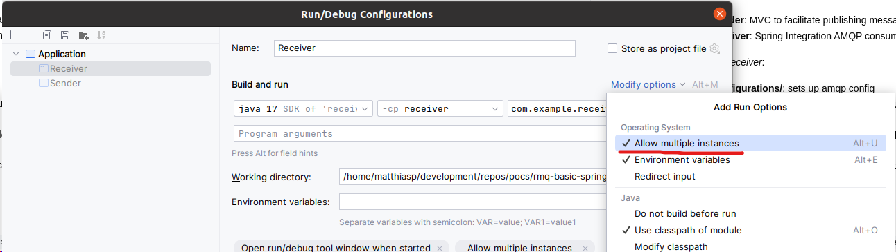

# Spring AMQP, RabbitMQ Shutdown POC

Simple POC to show the shutdown behaviour while using Single Active Consumers.  
Using Spring AMQP to handle interactions with RabbitMQ.

## Setup

- Start a clean instance of RabbitMQ. `docker-compose.yml` is provided to facilitate this; use `docker-compose up -d`.
- prefetch amount may be updated from `application.properties`

## Replication

POC is contained within `RabbitmqSacTest.java`. Each new instance will publish 20 messages and start listening to the
single active consumer queue. Message processing has a 10-second sleep for ease of debugging.

1. Login to rabbitmq at http://localhost:15672. Username/password: `guest`
2. Navigate to http://localhost:15672/#/queues/%2F/myQueue to view queue.
3. Start 2 instances of `RabbitmqSacTest.java`
    * You may need to allow multiple instances in your IDE. Example IntelliJ: 
4. View application logs.
5. Notice how only one instance processes messages.
6. Gracefully shutdown instance processing messages.
    * IDE shutdown button. Alternative on linux: `ps aux | grep receiver` to get process id. `kill -INT <process_id>`
7. Notice how second instance waits for first instance to complete its local messages before it starts processing.

All messages are processed in order. No bug detected.
